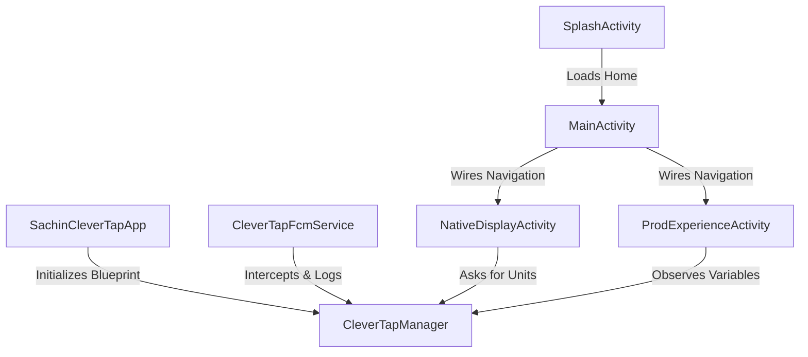

# com.example.rudderclevertapsample — Project Documentation

## 1. Project Overview
This project is an advanced, production-ready integration sample demonstrating the core features of the CleverTap Android SDK (v8.4.1) within a native Kotlin application architecture. It serves as a blueprint for implementing user profile tracking, complex multi-dimensional custom event telemetry, automated App Inbox messaging layouts, dynamic layout parsing via Native Display templates, and remote feature toggling using the CleverTap Variables capability.

## 2. Architecture
The application is built on top of a clean, modular Model-View-Controller (MVC/MVVM-ready) style mapping layers carefully separated by functional capabilities:
*   **Application Bootstrapper Layer**: Centralized configuration lifecycle setup in the custom Application subclass.
*   **CleverTap Core Integration Wrapper Layer**: Managed under an encapsulation utility (`CleverTapManager`), abstracting all structural references away from direct client UI activities.
*   **Notification Token & Handling Layer**: Custom remote service listeners processing incoming push notification message structures securely.
*   **User Interface Flow Layer**: Dedicated application workflows (`SplashActivity` -> `MainActivity` -> sub-screens) managing layout trees via ViewBinding.



## 3. Module Overview

| Module / Feature | Purpose | Main Classes/Files |
|---|---|---|
| **App Bootstrapper** | Orchestrates SDK initialization, notification channels, and telemetry warmup hooks. | [SachinCleverTapApp.kt](file:///Users/sachin.gajbhiye/Claude/SachinCleverTapNative/app/src/main/kotlin/com/example/rudderclevertapsample/SachinCleverTapApp.kt) |
| **CleverTap Manager Wrapper** | Encapsulates all structural profiles, custom analytics event calls, App Inbox settings, variables mapping, and layout listener hooks. | [CleverTapManager.kt](file:///Users/sachin.gajbhiye/Claude/SachinCleverTapNative/app/src/main/kotlin/com/example/rudderclevertapsample/clevertap/CleverTapManager.kt) |
| **FCM Push Notification Handling** | Intercepts remote background data payloads, generates client-side indicators, and tracks viewed impressions manually. | [CleverTapFcmService.kt](file:///Users/sachin.gajbhiye/Claude/SachinCleverTapNative/app/src/main/kotlin/com/example/rudderclevertapsample/notifications/CleverTapFcmService.kt) |
| **Splash Welcome Screen** | Plays an animated splash media template looping correctly for exactly 2 seconds prior to home handoffs. | [SplashActivity.kt](file:///Users/sachin.gajbhiye/Claude/SachinCleverTapNative/app/src/main/kotlin/com/example/rudderclevertapsample/ui/SplashActivity.kt) |
| **Main Action Hub Screen** | Core terminal surface verifying runtime push permissions, triggering identity alignments, pushing multi-nested item telemetry arrays, and controlling navigation. | [MainActivity.kt](file:///Users/sachin.gajbhiye/Claude/SachinCleverTapNative/app/src/main/kotlin/com/example/rudderclevertapsample/ui/MainActivity.kt) |
| **Native Display Rendering** | Implements standard native card generation algorithms pulling customized dynamic components from the workspace dashboard feed. | [NativeDisplayActivity.kt](file:///Users/sachin.gajbhiye/Claude/SachinCleverTapNative/app/src/main/kotlin/com/example/rudderclevertapsample/ui/NativeDisplayActivity.kt) |
| **Variables Remote Config** | Utilizes variables callback streams to dynamically alter interface textual parameters and images based on live configurations. | [ProdExperienceActivity.kt](file:///Users/sachin.gajbhiye/Claude/SachinCleverTapNative/app/src/main/kotlin/com/example/rudderclevertapsample/ui/ProdExperienceActivity.kt) |
| **Static Data Profiles** | Formulates standard identity attribute profiles and highly nested structure properties used for regression testing. | [SampleData.kt](file:///Users/sachin.gajbhiye/Claude/SachinCleverTapNative/app/src/main/kotlin/com/example/rudderclevertapsample/clevertap/SampleData.kt) |

---

## 4. App Bootstrapper Module

### Purpose
Acts as the single operational entry point for the Android runtime process, executing required operational preparation hooks before any activity layout component can initialize.

### Files / Classes
*   [SachinCleverTapApp.kt](file:///Users/sachin.gajbhiye/Claude/SachinCleverTapNative/app/src/main/kotlin/com/example/rudderclevertapsample/SachinCleverTapApp.kt)

### Methods

#### `onCreate()`
*   **Purpose**: Bootstraps the application framework instance, registers global lifecycle tracking, builds custom push distribution routes, and activates remote variables registration.
*   **Parameters**: None.
*   **Returns**: Unit.
*   **Behavior**:
    1. Invokes `ActivityLifecycleCallback.register(this)` immediately before calling `super.onCreate()`.
    2. Activates verbose tracking configurations via `CleverTapAPI.setDebugLevel`.
    3. Builds the custom high-importance notification distribution pipeline via `createNotificationChannel`.
    4. Triggers `CleverTapManager.initializeVariables(this)` to pre-instantiate variable mappings.
    5. Sets network info reporting status to true.
    6. Attaches the application instance as the root push click responder via `setCTPushNotificationListener`.
    7. Dispatches an automated schema mapping verification update via `syncVariables()`.
*   **Dependencies**: [CleverTapManager.kt](file:///Users/sachin.gajbhiye/Claude/SachinCleverTapNative/app/src/main/kotlin/com/example/rudderclevertapsample/clevertap/CleverTapManager.kt), `ActivityLifecycleCallback`, `CleverTapAPI`.

#### `onNotificationClickedPayloadReceived(payload: HashMap<String, Any>?)`
*   **Purpose**: Implements the `CTPushNotificationListener` callback interface to intercept data maps attached to push notifications when an user taps an action.
*   **Parameters**:
    *   `payload`: A nullable `HashMap` containing the complete data parameters transmitted inside the message structure.
*   **Returns**: Unit.
*   **Behavior**: Logs the parameter tracking map data fields into system Logcat outputs.
*   **Dependencies**: None.

### Execution Flow
```
System Application Launch -> ActivityLifecycleCallback.register() -> super.onCreate() -> Verbose Logs Active -> createNotificationChannel() -> initializeVariables() -> setCTPushNotificationListener() -> syncVariables()
```

---

## 5. CleverTap Manager Wrapper Module

### Purpose
An architectural wrapper encapsulation object ensuring view modules never reference the low-level third-party SDK dependencies directly, maintaining compile isolation and centralizing error/null handling configurations.

### Files / Classes
*   [CleverTapManager.kt](file:///Users/sachin.gajbhiye/Claude/SachinCleverTapNative/app/src/main/kotlin/com/example/rudderclevertapsample/clevertap/CleverTapManager.kt)

### Methods

#### `instance(context: Context)`
*   **Purpose**: Resolves the default shared instance of the CleverTap core API engine.
*   **Parameters**:
    *   `context`: Operating system environment handle.
*   **Returns**: A nullable `CleverTapAPI` instance.
*   **Behavior**: Extracts the application context and queries `CleverTapAPI.getDefaultInstance`.

#### `setProfile(context: Context, profile: Map<String, Any>)`
*   **Purpose**: Submits identity profile parameters to synchronize properties inside the dashboard data profile.
*   **Parameters**:
    *   `context`: Operating system environment handle.
    *   `profile`: Map bundle specifying traits (Default value: `SampleData.sampleProfile()`).
*   **Returns**: Unit.
*   **Behavior**: Fetches the core instance safely; if null, routes tracking logs via `logMissing`. Otherwise, triggers `ct.onUserLogin(profile)`.

#### `pushEvent(context: Context, eventName: String, properties: Map<String, Any>?)`
*   **Purpose**: Records a custom transactional event telemetry map point.
*   **Parameters**:
    *   `context`: Operating system environment handle.
    *   `eventName`: Unique descriptor string.
    *   `properties`: Nullable parameters dictionary.
*   **Returns**: Unit.
*   **Behavior**: Verifies instance presence. If properties are empty or null, pushes via `ct.pushEvent(eventName)`, else passes through `ct.pushEvent(eventName, properties)`.

#### `pushAddToSachinEvent(context: Context)`
*   **Purpose**: Helper shorthand pushing the specific complex `College_add_to_sachin` sample telemetry package.
*   **Parameters**:
    *   `context`: Operating system environment handle.
*   **Returns**: Unit.
*   **Behavior**: Dispatches `pushEvent` with pre-defined static properties derived from `SampleData`.

#### `initializeInbox(context: Context, listener: CTInboxListener)`
*   **Purpose**: Activates the integrated App Inbox message cache sequence.
*   **Parameters**:
    *   `context`: Operating system environment handle.
    *   `listener`: Target tracking module callback responder interface.
*   **Returns**: Unit.
*   **Behavior**: Assigns the listener interface to `ct.setCTNotificationInboxListener` and calls `ct.initializeInbox()`.

#### `inboxUnreadCount(context: Context)`
*   **Purpose**: Queries the amount of current unread messages sitting inside the local memory buffer.
*   **Parameters**:
    *   `context`: Operating system environment handle.
*   **Returns**: An `Int` representing unread message count. Returns `0` if the SDK instance is un-initialized.

#### `showAppInbox(context: Context)`
*   **Purpose**: Inflates a customized Material design App Inbox Activity view overlay using explicit theme settings.
*   **Parameters**:
    *   `context`: Operating system environment handle.
*   **Returns**: Unit.
*   **Behavior**: Instantiates an explicit `CTInboxStyleConfig` object, setting navigation title properties (`"Sachin's Inbox"`), status bar colors (`#1E88E5`), custom background structures, and tab routing parameters (`"Offers"`, `"Updates"`), before calling `ct.showAppInbox(style)`.

#### `setDisplayUnitListener(context: Context, listener: DisplayUnitListener)`
*   **Purpose**: Assigns the receiver pipeline for processing live native display layout modifications.
*   **Parameters**:
    *   `context`: Operating system environment handle.
    *   `listener`: View destination interface.
*   **Returns**: Unit.

#### `cachedDisplayUnits(context: Context)`
*   **Purpose**: Collects active native display entities already residing inside local memory storage structures.
*   **Parameters**:
    *   `context`: Operating system environment handle.
*   **Returns**: A `List<CleverTapDisplayUnit>` representation stream.

#### `trackDisplayUnitViewed(context: Context, unitId: String)`
*   **Purpose**: Logs a manual viewed analytical impression event for a specific display unit ID.
*   **Parameters**:
    *   `context`: Operating system environment handle.
    *   `unitId`: Unique identifier hash string.
*   **Returns**: Unit.

#### `trackDisplayUnitClicked(context: Context, unitId: String)`
*   **Purpose**: Logs a manual click transactional engagement marker for a specific display unit ID.
*   **Parameters**:
    *   `context`: Operating system environment handle.
    *   `unitId`: Unique identifier hash string.
*   **Returns**: Unit.

#### `isPushPermissionGranted(context: Context)`
*   **Purpose**: Queries whether push transmission access is permitted on this deployment build.
*   **Parameters**:
    *   `context`: Operating system environment handle.
    *   **Returns**: A `Boolean` value representing permission status.

#### `initializeVariables(context: Context)`
*   **Purpose**: Reserves and instantiates variable registration pointers across the ecosystem.
*   **Parameters**:
    *   `context`: Operating system environment handle.
*   **Returns**: Unit.
*   **Behavior**: Leverages `ct.defineVariable` for parameters `"Color"` and `"ProductName"`, and `ct.defineFileVariable` for `"AppIcon"` storage properties.

---

## 6. FCM Push Notification Handling Module

### Purpose
Handles incoming Firebase Cloud Messaging remote background data packets, translating parameters into valid user notifications and accurately tracking impression metrics manually.

### Files / Classes
*   [CleverTapFcmService.kt](file:///Users/sachin.gajbhiye/Claude/SachinCleverTapNative/app/src/main/kotlin/com/example/rudderclevertapsample/notifications/CleverTapFcmService.kt)

### Methods

#### `onMessageReceived(message: RemoteMessage)`
*   **Purpose**: Fired automatically by the operating system daemon whenever a live background push arrives.
*   **Parameters**:
    *   `message`: Structural data entity containing remote transmission data maps.
*   **Returns**: Unit.
*   **Behavior**:
    1. Inspects if `message.data` contains active fields.
    2. Converts raw properties map entries manually inside a standard Android `Bundle` item structure.
    3. Queries `CleverTapAPI.getNotificationInfo(extras)` to safely confirm whether the traffic originates from a configured CleverTap campaign.
    4. If true, triggers `CleverTapAPI.createNotification(applicationContext, extras)` to prompt standard system layouts.
    5. Dispatches an explicit telemetry notification confirmation call via `pushNotificationViewedEvent(extras)` to preserve manual analytics tracking indicators.
*   **Dependencies**: `RemoteMessage`, `Bundle`, `CleverTapAPI`.

#### `onNewToken(token: String)`
*   **Purpose**: Triggered whenever the system refreshes or assigns a new FCM device routing token pointer.
*   **Parameters**:
    *   `token`: Refreshed system string identifier.
*   **Returns**: Unit.
*   **Behavior**: Forwards the token reference straight to `CTFcmMessageHandler().onNewToken` to register the hardware address with the targeted dashboard user map profiles.

---

## 7. Splash Welcome Screen Module

### Purpose
Displays a full-screen, branded, loop-safe animated media template upon initial boot sequence configurations, enforcing a strict presentation delay interval prior to allowing interactions with the primary home action hub screen.

### Files / Classes
*   [SplashActivity.kt](file:///Users/sachin.gajbhiye/Claude/SachinCleverTapNative/app/src/main/kotlin/com/example/rudderclevertapsample/ui/SplashActivity.kt)

### Methods

#### `onCreate(savedInstanceState: Bundle?)`
*   **Purpose**: Sets up full-screen constraints, binds the `VideoView` layout structure, configures video looping, and schedules the home handoff timer.
*   **Parameters**:
    *   `savedInstanceState`: System activity state bundle.
*   **Returns**: Unit.
*   **Behavior**:
    1. Inflates the ViewBinding hierarchy `ActivitySplashBinding`.
    2. Converts the resource link pointer `R.raw.splash_video` into a clean Android Uri path.
    3. Activates an `OnPreparedListener` assigning `mp.isLooping = true` to force seamless looping.
    4. Schedules the execution of a background task thread runnable (`timeoutRunnable`) using `postDelayed` set to **exactly 2000 milliseconds (2 seconds)**.
    5. Hooks up an `OnErrorListener` to ensure that if any media decoding failures happen, the activity intercept clears and navigates cleanly to the home page without freezing.
*   **Dependencies**: `ActivitySplashBinding`, `VideoView`, `toUri()`.

#### `onDestroy()`
*   **Purpose**: Guarantees secure view allocation lifecycle cleanups.
*   **Parameters**: None.
*   **Returns**: Unit.
*   **Behavior**: Explicitly purges pending delayed task pointers by invoking `binding.root.removeCallbacks(timeoutRunnable)` to avoid background memory leaks.

#### `startMainActivity()`
*   **Purpose**: Transitions out of the splash view and into the primary application dashboard interface.
*   **Parameters**: None.
*   **Returns**: Unit.
*   **Behavior**: Evaluates `isFinishing` validation checks; if safe, fires an explicit `Intent` pointing to `MainActivity` and calls `finish()`.

---

## 8. Main Action Hub Screen Module

### Purpose
Serves as the primary configuration playground dashboard layout workspace surface, enabling developers to prompt runtime request prompts, register identities, send nested telemetry payloads, and cross-navigate sub-features.

### Files / Classes
*   [MainActivity.kt](file:///Users/sachin.gajbhiye/Claude/SachinCleverTapNative/app/src/main/kotlin/com/example/rudderclevertapsample/ui/MainActivity.kt)

### Methods

#### `onCreate(savedInstanceState: Bundle?)`
*   **Purpose**: Sets up standard button bindings, initializes the App Inbox layout connection pipelines, and verifies runtime push notifications accessibility.
*   **Parameters**:
    *   `savedInstanceState`: System state context bundle.
*   **Returns**: Unit.
*   **Behavior**:
    1. Standard inflation of `ActivityMainBinding`.
    2. Registers the activity to handle App Inbox lifecycle status events via `CleverTapManager.initializeInbox(this, this)`.
    3. Binds click events:
        *   `btnProfileSet` -> Triggers `CleverTapManager.setProfile(this)` and prints out confirmation statuses tracking the targeting `Identity` parameter tag value.
        *   `btnEvent` -> Fires `CleverTapManager.pushAddToSachinEvent(this)`.
        *   `btnNativeDisplay` -> Routes execution paths directly to `NativeDisplayActivity`.
        *   `btnProdExperience` -> Routes execution paths directly to `ProdExperienceActivity`.
        *   `btnInbox` -> Fires internal utility `openInbox()`.
    4. Invokes `requestNotificationPermissionIfNeeded()`.

#### `onResume()`
*   **Purpose**: Re-evaluates badge indicator metrics whenever a user returns focus back to the workspace environment.
*   **Parameters**: None.
*   **Returns**: Unit.
*   **Behavior**: Invokes internal utility helper routine `refreshInboxBadge()`.

#### `inboxDidInitialize()`
*   **Purpose**: Interface callback signaling that the App Inbox engine data synchronization is complete and ready.
*   **Parameters**: None.
*   **Returns**: Unit.
*   **Behavior**: Assigns internal tracking flag status `inboxReady = true` and updates badge arrays via `refreshInboxBadge()`.

#### `inboxMessagesDidUpdate()`
*   **Purpose**: Callback interface notification fired whenever inbox items undergo updates, reads, or state deletes.
*   **Parameters**: None.
*   **Returns**: Unit.

#### `openInbox()`
*   **Purpose**: Safely invokes the pre-styled App Inbox layer view interface.
*   **Parameters**: None.
*   **Returns**: Unit.
*   **Behavior**: Validates if `inboxReady` is true. If false, alerts user via system Toast toast alerts; if true, runs `CleverTapManager.showAppInbox(this)`.

#### `refreshInboxBadge()`
*   **Purpose**: Adjusts the red numeric counter indicator overlaying the home screen notification bell icon.
*   **Parameters**: None.
*   **Returns**: Unit.
*   **Behavior**: Gathers current metrics via `CleverTapManager.inboxUnreadCount(this)`. Dispatches a `runOnUiThread` sequence to dynamically populate `binding.txtInboxBadge.text`. If the unread metric is greater than 0, sets view visibility state to `VISIBLE`, else turns it to `GONE`.

#### `requestNotificationPermissionIfNeeded()`
*   **Purpose**: Enforces structural runtime permission dialog triggers on deployment targets operating on Android 13 (API 33 / Tiramisu) or newer.
*   **Parameters**: None.
*   **Returns**: Unit.
*   **Behavior**: Confirms if `Build.VERSION.SDK_INT` reaches Tiramisu thresholds. Checks current system context validation state via `ContextCompat.checkSelfPermission`. If access isn't already authorized, launches the request sequence pipeline tracking via `notificationPermissionLauncher`.

#### `setStatus(message: String)`
*   **Purpose**: Utility function logging feedback descriptions both onto on-screen status views and hardware alerts.
*   **Parameters**:
    *   `message`: Text description string.
*   **Returns**: Unit.

---

## 9. Native Display Rendering Module

### Purpose
Implements an layout generation template processing native display campaign entities delivered from the server, dynamically drawing cards while providing manual analytics tracking markers.

### Files / Classes
*   [NativeDisplayActivity.kt](file:///Users/sachin.gajbhiye/Claude/SachinCleverTapNative/app/src/main/kotlin/com/example/rudderclevertapsample/ui/NativeDisplayActivity.kt)

### Methods

#### `onCreate(savedInstanceState: Bundle?)`
*   **Purpose**: Establishes ViewBinding hierarchies, presets default placeholder assets, configures listener handles, and conducts an initial scan for pre-cached display items.
*   **Parameters**:
    *   `savedInstanceState**: Context state parameters bundle.
*   **Returns**: Unit.
*   **Behavior**:
    1. Standard layout inflation of `ActivityNativeDisplayBinding`.
    2. Leverages Glide to populate `binding.imgDefault` with fallback resource items (`SampleData.DEFAULT_NATIVE_DISPLAY_IMAGE_URL`) overlaying placeholder attributes (`R.drawable.ic_image_placeholder`).
    3. Registers the activity to catch native unit loading notifications via `CleverTapManager.setDisplayUnitListener(this, this)`.
    4. Attaches listener tracking hooks for optional in-app events via `setInAppNotificationListener(this)`.
    5. Scans and immediately paints any pre-existing items already resting in storage pools via `renderDisplayUnits(CleverTapManager.cachedDisplayUnits(this))`.

#### `onDisplayUnitsLoaded(units: ArrayList<CleverTapDisplayUnit>?)`
*   **Purpose**: Core listener override interface triggered by the CleverTap SDK whenever a campaign evaluation cycle delivers matching layout cards.
*   **Parameters**:
    *   `units`: Collection sequence array listing targeting active native structures.
*   **Returns**: Unit.
*   **Behavior**: Forwards the nullable list elements safely into an explicit main ui execution block via `runOnUiThread { renderDisplayUnits(units.orEmpty()) }`.

#### `renderDisplayUnits(units: List<CleverTapDisplayUnit>)`
*   **Purpose**: Iterates over data maps, clears layout containers, inflates view items dynamically, handles image asset caching, and establishes impression reporting links.
*   **Parameters**:
    *   `units`: Structural entities sequence tracking elements to be displayed.
*   **Returns**: Unit.
*   **Behavior**:
    1. Flushes out all existing layout items out of the scrolling shell via `container.removeAllViews()`.
    2. Adjusts visibility states on empty state placeholder elements (`binding.txtNoUnits`, `binding.imgDefault`) based on list evaluations.
    3. Loops through each display item, drilling down into inner nested data arrays (`unit.contents`).
    4. Inflates item sub-views via `ItemDisplayUnitBinding.inflate`.
    5. Populates text properties (`content.title`, `content.message`) and parses custom hex color fields (`content.titleColor`, `content.messageColor`, `unit.bgColor`) via safe utility method `parseColor`.
    6. If media configurations indicate active image assets (`mediaIsImage()` / `mediaIsGIF()`), prompts Glide loaders to resolve raw network resources into `item.imgMedia`.
    7. Attaches custom tap interaction listeners onto card hulls: when triggered, calls `CleverTapManager.trackDisplayUnitClicked(this, unit.unitID)` and opens deep-link actions via explicit `Intent.ACTION_VIEW` routes.
    8. appends layout item hulls straight into the primary display shell hierarchy container via `container.addView(item.root)`.
    9. Explicitly reports rendering completions back to analytics trackers via `CleverTapManager.trackDisplayUnitViewed(this, unit.unitID)`.

#### `parseColor(hex: String?)`
*   **Purpose**: Converts hex data text entries safely into absolute integer color references.
*   **Parameters**:
    *   `hex`: Nullable structural string code descriptor (e.g. `"#FFFFFF"`).
*   **Returns**: A nullable `Int` color resource index indicator. Returns null if parameters are blank or fail transformation constraints under `Color.parseColor`.

---

## 10. Variables Remote Config Module

### Purpose
Implements real-time configuration tuning via CleverTap Variables tracking, adjusting layout parameter settings and downloading remote mock icon file entities without requiring build distribution cycles.

### Files / Classes
*   [ProdExperienceActivity.kt](file:///Users/sachin.gajbhiye/Claude/SachinCleverTapNative/app/src/main/kotlin/com/example/rudderclevertapsample/ui/ProdExperienceActivity.kt)

### Methods

#### `onCreate(savedInstanceState: Bundle?)`
*   **Purpose**: Binds layout boundaries, sets immediate view properties, initializes live update listeners, and requests explicit parameter checks from the server.
*   **Parameters**:
    *   `savedInstanceState`: State parameter bundle.
*   **Returns**: Unit.
*   **Behavior**:
    1. ViewBinding tree setup for `ActivityProdExperienceBinding`.
    2. Immediately triggers internal utility routine `updateUiWithVariables()` to ensure local code fallback parameters display on fields instantly upon initialization.
    3. Registers custom interface change monitor tracking via `CleverTapManager.instance(this)?.addVariablesChangedCallback(variablesChangedCallback)`.
    4. Commands background synchronizations explicitly to check for recent server modifications via `fetchVariables(null)`.

#### `updateUiWithVariables()`
*   **Purpose**: Resolves value bindings and re-renders configuration fields safely under appropriate main thread tasks.
*   **Parameters**: None.
*   **Returns**: Unit.
*   **Behavior**:
    1. Wraps operations under explicit `runOnUiThread` sequences.
    2. Extracts current properties values out of variable pointers, applying native hardcoded fallbacks if structural wrappers are unassigned (`varColor?.value() ?: "Grey"`, `varProductName?.value() ?: "clevertap"`).
    3. Populates target on-screen elements `binding.txtColor.text` and `binding.txtProductName.text`.
    4. Evaluates file asset variables properties pointers via `CleverTapManager.varAppIcon?.value()`. If a valid downloaded file reference string path is resolved, commands Glide to draw the file asset onto `binding.imgAppIcon`, applying proper fallback placeholders (`R.mipmap.ic_launcher`). If un-configured, directly falls back to system icon mipmaps.

#### `onDestroy()`
*   **Purpose**: Destructures notification references to avoid memory leaks.
*   **Parameters**: None.
*   **Returns**: Unit.
*   **Behavior**: Invokes `removeVariablesChangedCallback(variablesChangedCallback)` safely before letting the activity terminate.

---

## 11. Inter-Module Dependencies
The application architecture enforces strict decoupled isolation protocols via the [CleverTapManager.kt](file:///Users/sachin.gajbhiye/Claude/SachinCleverTapNative/app/src/main/kotlin/com/example/rudderclevertapsample/clevertap/CleverTapManager.kt) wrapper model:

```
[UI Layer: Activities] ---> [CleverTapManager Wrapper Wrapper] ---> [CleverTap Core Android SDK]
         |                                ^
         v                                |
  [SampleData] ---------------------------+
```
1.  **Bootstrapping Sequence**: [SachinCleverTapApp.kt](file:///Users/sachin.gajbhiye/Claude/SachinCleverTapNative/app/src/main/kotlin/com/example/rudderclevertapsample/SachinCleverTapApp.kt) is the root dependency initializer, passing initial structural context references down to setup wrappers.
2.  **Telemetry Data Provisioning**: UI Activity instances utilize [SampleData.kt](file:///Users/sachin.gajbhiye/Claude/SachinCleverTapNative/app/src/main/kotlin/com/example/rudderclevertapsample/clevertap/SampleData.kt) blueprints to construct payload mappings, routing data structures through `CleverTapManager` parameter options rather than interacting with the third-party framework layers natively.
3.  **Variable Lifecycle Mapping**: [ProdExperienceActivity.kt](file:///Users/sachin.gajbhiye/Claude/SachinCleverTapNative/app/src/main/kotlin/com/example/rudderclevertapsample/ui/ProdExperienceActivity.kt) directly depends on variable allocations tracked globally as shared state points inside `CleverTapManager`.

---

## 12. Configuration

### 2.1 Dashboard Identification Attributes (`clevertap.properties`)
Core routing tokens are declared once inside the project root workspace config file and are automatically injected during build phases into the manifest as system placeholders:
```properties
CLEVERTAP_ACCOUNT_ID=xxxxxxxx
CLEVERTAP_TOKEN=xxxxxxxx
CLEVERTAP_REGION=eu1
```

### 2.2 Version Catalog References (`gradle/libs.versions.toml`)
Structural compile ecosystem components are centralized under standard Gradle catalog files:
```toml
compileSdk = "37"
targetSdk = "37"
minSdk = "23"
clevertap = "8.4.1"
firebaseBom = "34.19.0"
```

---

## 13. Setup & Usage

### Step 1: Clone and Synchronize Build Trees
1. Open the project root folder directory using **Android Studio (Ladybug or newer)**.
2. Allow the Gradle system wrapper configuration to automatically download core dependencies specified inside the version catalogs catalog scripts.
3. Ensure your local building environment uses **JDK 17** or newer.

### Step 2: Configure Firebase Assets
1. Download your targeted project asset profile `google-services.json` from your custom Firebase developer console panel.
2. Paste the file directly inside the module directory path: **`app/google-services.json`**.
3. Re-execute project compilation. The build configuration automatically activates the Google Services distribution plugin bindings upon spotting the file.

### Step 3: Deployment & Analytics Verification
1. Click **Run app** to deploy to a physical hardware testing device or emulator system.
2. Tap **"Profile Set"** on the home screen interface layout to instantly trigger user identity registration algorithms for user sequence ID `sachin_001`.
3. Tap **"Event"** to push your complex multi-nested array course shopping data packages directly up to the dashboard monitoring feeds.
4. Access **"ProdExperience"** or **"Native Display"** sub-screens to test variable modification overrides or live card rendering cycles.

---

## 14. Important Notes / Limitations
*   **Variable Allocation in Kotlin**: The CleverTap SDK annotation capability (`@Variable`) is natively limited to Java source architectures. This project bypasses this limitation cleanly by leveraging programmatic initialization wrappers (`defineVariable` and `defineFileVariable`) inside the unified wrapper class.
*   **App Inbox Readiness**: The App Inbox asset structure requires an initial background network synchronization layout loop to fetch and cache messages. Attempting to open the Inbox layout view frame before the `inboxDidInitialize` callback interface completes validation will safely log fallbacks and display a descriptive warning Toast notification to prevent system instability.
